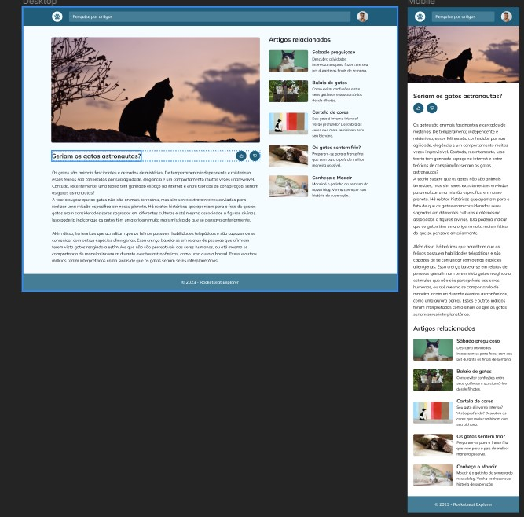

  

  

## 🖥️ Projeto
Esse é o resultado do desafio do curso Explore onde fizemos um projeto web de uma página para um blog, nesse específico sobre gatos, onde aplicamos a responsividade, ou seja, ajustando o conteúdo para aparelhos mobile e desktop.

## 🚀 Tecnologias
Esse projeto foi desenvolvido durante o cursos de Explore da Rocketsat com as seguintes tecnologias:

- HTML
- CSS
- GIT E GITHUB
- FIGMA

## 🏷️layout
Você pode visualizar o layout do projeto através 
[desse link](https://www.figma.com/file/1xQqsPWmPYtJa3RuJrS7LE/Blog-de-Gatos-%E2%80%A2-Desafio-Explorer-(Community)?node-id=0%3A208&mode=dev).
É necessario ter uma conta no [Figma](https://www.figma.com).